# imgui-md2 接口文档

本文对应 `0.1.0`。所有公开符号位于 `ImGuiMD2` 命名空间，聚合头文件为：

工程当前统一使用 Dear ImGui `v1.92.8`；standalone 与父工程的 xmake 配置均锁定
同一官方版本。

```cpp
#include <imgui_md2/imgui_md2.h>
```

## 1. 生命周期

```cpp
Context* CreateContext();
void DestroyContext(Context* context = nullptr);
Context& GetContext();
Theme& GetTheme();
void SetTheme(const Theme& theme, bool apply_imgui_style = true);
Animator& GetAnimator();
void NewFrame();
```

MD2 context 按 `ImGuiContext*` 隔离。`GetContext()` 和组件会按需创建 context；
多 viewport 仍共享所属 ImGui context 的主题与动画状态。`NewFrame()` 是幂等的，
同一 ImGui frame 只更新一次，通常无需手工调用。

若使用多个 ImGui context，请先 `ImGui::SetCurrentContext()`，再访问对应 MD2
context。线程安全规则与 Dear ImGui 相同。

## 2. 颜色与主题

### `Color`

```cpp
struct Color {
    float r, g, b, a;
    static constexpr Color FromHex(uint32_t rgb, float alpha = 1.0f);
    constexpr Color WithAlpha(float alpha) const;
    constexpr ImVec4 Vec4() const;
    ImU32 U32(float alpha_multiplier = 1.0f) const;
};

Color Mix(Color a, Color b, float amount);
Color Composite(Color foreground, Color background);
float RelativeLuminance(Color color);
float ContrastRatio(Color a, Color b);
Color AccessibleOnColor(Color background);
Color ParseHex(const char* hex);
Color with_alpha(Color color, float alpha);
Color state_overlay(Color content, float opacity);
Color emphasize(Color on_surface, float emphasis);
Color clear_color();
```

`Composite` 执行标准 source-over 合成；`AccessibleOnColor` 在白色与 87% 黑色
之间选择对比度更高者。

### 调色板

```cpp
Color Palette(Swatch swatch, Shade shade = Shade::S500);
```

`Swatch` 包括 Red、Pink、Purple、DeepPurple、Indigo、Blue、LightBlue、
Cyan、Teal、Green、LightGreen、Lime、Yellow、Amber、Orange、DeepOrange、
Brown、Grey、BlueGrey。`Shade` 包括 S50..S900、A100/A200/A400/A700。
Brown/Grey/BlueGrey 没有官方 accent 色，accent 请求回退到 S500（下图中三行的
`A100..A700` 四列颜色重复）。

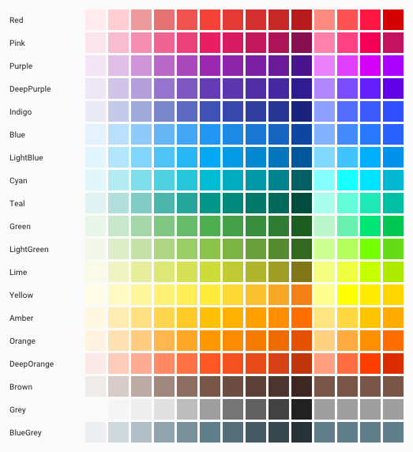

### `Theme`

```cpp
Theme Theme::Light();
Theme Theme::Light(Color primary, Color secondary);
Theme Theme::Dark();
Theme Theme::Dark(Color primary, Color secondary);
Theme Theme::LightFromPrimary(Swatch primary, Swatch secondary = Swatch::Amber);
Theme Theme::DarkFromPrimary(Swatch primary, Swatch secondary = Swatch::Teal);
Theme Theme::BaselineLight();
Theme Theme::BaselineDark();
Theme Theme::Named(const char* name);
bool ApplyNamedTheme(const char* name, bool invert_secondary = false);
void ApplyTheme(const Theme&, ImGuiStyle* destination = nullptr);
```

`Theme` 包含：

- `colors`：15 个语义色及 `dark` 标志；
- `shapes`：small、medium、large、full；
- `states`：hover/focus/pressed/selected/activated/disabled opacity；
- `motion`：短/中/长/复杂时长和 ripple 时长；
- `layout`：density、touch target、button/text field/app bar 高度与 8dp grid；
- `fonts`：13 个排版字体和 Material Icons 字体。

`SetTheme(theme, true)` 同时保存主题并映射到 `ImGuiStyle`。传 `false` 可只更换
MD2 组件主题，不触碰原生 ImGui 样式。`ThemeScope` 用 RAII 临时替换 ImGuiStyle。

`Theme::Light()` / `Dark()` 使用 `pluma/md2` 同样的 Green/Amber 默认组合；
`BaselineLight()` / `BaselineDark()` 是经典 DeepPurple/Teal 与 Purple/Teal。
`Theme::Named()` 内置 26 个 `qt-material` 风格资源，接受可选的 `.xml` 后缀；
未知名称回退到 `BaselineDark()`，`default`、`default_dark` 和 `default_light`
提供兼容别名。需要从外部 XML/配置导入时，填充 `ThemeResource` 后调用
`Theme::FromResource()`。

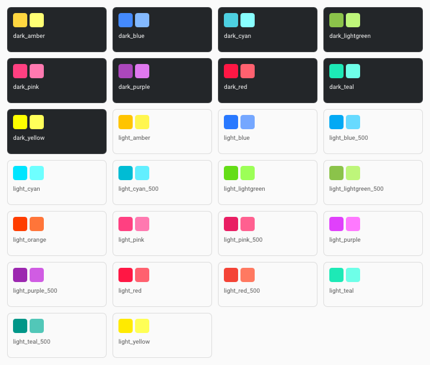

```cpp
struct ThemeResource {
    Color primary, primary_light;
    Color secondary, secondary_light, secondary_dark;
    Color primary_text, secondary_text;
    bool dark;
    const char* name;
};
Theme Theme::FromResource(const ThemeResource&, bool invert_secondary = false);
const char* const* Theme::named_ids();
int Theme::named_count();
```

状态层透明度可通过 `StateLayers` / `StateOpacity` 使用：hover 0.04、surface
hover 0.08、focus/pressed 0.12、dragged 0.16、activated 0.24；
`Emphasis::high/medium/disabled` 为 0.87/0.60/0.38。

## 3. 排版与字体

```cpp
const TypeScale& Typography(TextStyle style);
void SetTypeface(TypeRole role, ImFont* font);
ImFont* Typeface(TypeRole role);
void PushTypeface(TypeRole role);
void PopTypeface();
bool LoadBundledFonts(ImFontAtlas& atlas, TypographyFonts& result,
                      const std::string& asset_directory = {},
                      const FontLoadOptions& options = {},
                      std::string* error = nullptr);
void Text(TextStyle style, const char* text,
          Color color = Color(0, 0, 0, -1));
```

`TextStyle` 为 Headline1..6、Subtitle1..2、Body1..2、Button、Caption、Overline。
`TypeScale` 提供 size、line_height、letter_spacing、weight、uppercase。

`FontLoadOptions::scale` 用于 DPI 缩放；`full_type_scale=false` 只加载一份 16px
Roboto 并复用于所有 style，可显著减少 atlas。`glyph_ranges` 为空时使用 ImGui
默认范围。加载后由渲染后端重建并上传 atlas 纹理。使用 ImGui 1.92+ 新版后端时，
不要在 `ImGuiBackendFlags_RendererHasTextures` 设置前手动调用 `ImFontAtlas::Build()`；
初始化渲染后端后，由 `NewFrame()` 流程自动完成 atlas 构建与上传。

当 `asset_directory` 为空且 `prefer_embedded=true`（默认）时，库优先使用编译进
程序的 Regular Roboto 与 Material Icons，合计约 520KB 原始字体数据。内置数据位于
可执行文件只读段，并以 `FontDataOwnedByAtlas=false` 交给 ImGui，因此不会再复制
一份 TTF 到堆上。默认构建使用此模式。若需要完整 Light/Regular/Medium 字重，
启用 xmake 选项 `--imgui_md2_embed_full_fonts=true`；否则 `full_type_scale=true`
会回退到 `assets/fonts` 的外部文件。字体资源更新后运行：

```powershell
powershell -ExecutionPolicy Bypass -File scripts/generate_embedded_fonts.ps1
```

这是一种“磁盘/可执行文件内置、运行时不复制原始 TTF”的方案；字体栅格化后的
ImGui Atlas 和渲染器 GPU 纹理仍会占用运行时内存。

Material Icons 不依赖 ligature shaping；使用 `Icons::Search`、`Icons::Close` 等
UTF-8 码点常量传给图标参数。

`TypeRole::Regular/Medium/Title` 是面向宿主字体系统的轻量桥接：可注入自定义
字体，再用 `PushTypeface`/`PopTypeface` 包住一段 ImGui 文本。
`TextH1`…`TextH6`、`TextSubtitle1/2`、`TextBody1/2`、`TextCaption` 和
`TextOverline` 是 `Text(TextStyle, ...)` 的快捷封装。

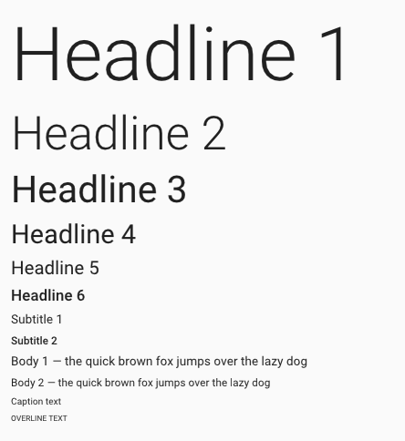

## 3.1 密度与 M2 指标

```cpp
void SetDpiScale(float scale);
float DpiScale();
void SetDensityScale(int scale); // [-3, +3]，每级 4dp
int DensityScale();
float Dp(float grid_units);       // 8dp 栅格
float DensityDp(float base_dp);
float Sp(float size_sp);
```

`Metrics` 提供 App Bar 56dp、按钮 36×64dp、FAB 56/40dp、Chip 32dp、TextField
56dp、列表 48/56/72/88dp、图标 24dp、触控目标 48dp、Dialog 最小宽 280dp、
Snackbar 48dp、Progress 4dp、Switch 36×14dp 等常用尺寸。组件默认值优先读取
这些指标；宿主只需在创建字体和提交 UI 前设置 DPI/密度。

## 4. 动画

```cpp
float Ease(Easing easing, float progress);

float Animator::Animate(ImGuiID id, float target, float duration,
                        Easing easing = Easing::Standard);
ImVec2 Animator::Animate(ImGuiID id, ImVec2 target, float duration,
                         Easing easing = Easing::Standard);
void Animator::Snap(ImGuiID id, float/ImVec2 value);
void Animator::Remove(ImGuiID id);
void Animator::Clear();
```

`Easing` 包括 Linear、Standard、Deceleration、Acceleration、Sharp。`Animate`
可在运动过程中改变 target；新轨道从首次 target 开始，若需指定初值先调用
`Snap`。长期未触及的轨道会自动回收。

自定义控件示例：

```cpp
ImGuiID id = ImGui::GetID("panel-alpha");
float alpha = ImGuiMD2::GetAnimator().Animate(
    id, open ? 1.0f : 0.0f, 0.225f, ImGuiMD2::Easing::Standard);
```

## 5. 输入与操作组件

### 按钮

```cpp
bool Button(const char* label, const ButtonOptions& = {});
bool TextButton(const char* label, ImVec2 size = {});
bool OutlinedButton(const char* label, ImVec2 size = {});
bool ContainedButton(const char* label, ImVec2 size = {});
bool IconButton(const char* id, const char* icon, bool selected = false,
                bool enabled = true, float size = -1.0f);
bool FloatingActionButton(const char* id, const char* icon,
                          const char* label = nullptr, bool enabled = true);
```

`ButtonOptions` 可设置 Text/Outlined/Contained、尺寸、leading icon、enabled 和
full width。label 的 `##`/`###` ID 语义与 ImGui 一致。

| Text | Outlined | Contained |
| --- | --- | --- |
| 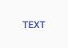 | 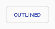 |  |

| IconButton | FloatingActionButton | FloatingActionButton（带 label） |
| --- | --- | --- |
| 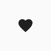 | 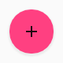 | 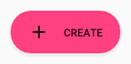 |

### 选择控件

```cpp
bool Checkbox(const char*, bool*, bool enabled = true);
bool RadioButton(const char*, int*, int button_value, bool enabled = true);
bool Switch(const char*, bool*, bool enabled = true);
bool SliderFloat(const char*, float*, float min, float max,
                 const char* format = "%.2f", bool enabled = true);
```

所有选择控件使用 48dp 交互目标；可见图形按 M2 尺寸绘制。

| Checkbox | RadioButton | Switch | SliderFloat |
| --- | --- | --- | --- |
| 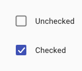 | 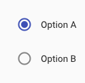 | 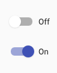 | 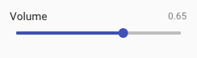 |

### 文本字段与下拉选择

```cpp
bool TextField(const char* label, char* buffer, size_t buffer_size,
               const TextFieldOptions& = {}, ImGuiInputTextFlags flags = 0);
bool Select(const char* label, int* current, const char* const* items,
            int count, bool enabled = true, float width = 0);
```

`TextFieldOptions` 支持 Filled/Outlined、helper text、leading/trailing icon、
error、enabled、自定义尺寸。复杂校验由调用方维护，只需设置 `error` 与 helper。

| TextField（Filled，带 helper text） | TextField（Outlined） | Select |
| --- | --- | --- |
| 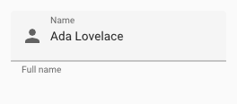 | 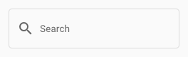 | 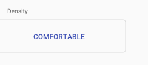 |

## 6. 内容与导航组件

```cpp
void LinearProgress(float fraction, ImVec2 size = {-1, 4});
void LinearProgressIndeterminate(const char* id, ImVec2 size = {-1, 4});
void CircularProgress(const char* id, float fraction = -1,
                      float radius = 16, float thickness = 3);

bool BeginCard(const char* id, ImVec2 size = {}, int elevation = 1,
               bool outlined = false);
void EndCard();
bool ListItem(...);
void Divider(float inset = 0);

bool Chip(const char*, bool* selected = nullptr,
          const char* leading_icon = nullptr, bool enabled = true);
bool DismissibleChip(const char*, bool* dismissed,
                     const char* leading_icon = nullptr, bool enabled = true);
bool Tabs(const char* id, const char* const* labels, int count,
          int* current, bool fixed = true);
void Badge(const char* text, ImVec2 screen_anchor, Color color = sentinel);
void Avatar(const char* id, const char* initials, float diameter = 40,
            Color color = sentinel);
```

每个成功的 `BeginCard` 都必须对应 `EndCard`。`CircularProgress` 的 fraction < 0
表示 indeterminate。`Badge` 的 anchor 是屏幕坐标，可直接使用
`ImGui::GetItemRectMax()`。

| LinearProgress | LinearProgressIndeterminate | CircularProgress | CircularProgressIndeterminate |
| --- | --- | --- | --- |
| 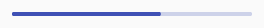 | 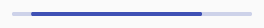 |  |  |

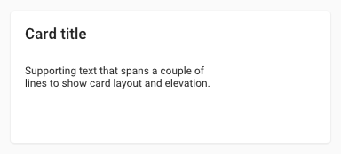

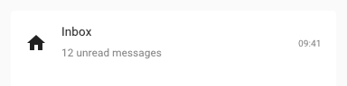

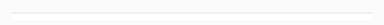

| Chip（默认/selected） | DismissibleChip | Tabs |
| --- | --- | --- |
| 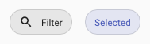 | 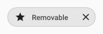 | 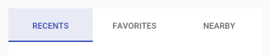 |

| Badge | Avatar |
| --- | --- |
| 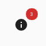 | 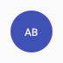 |

## 7. 容器、反馈与覆盖层

```cpp
bool BeginTopAppBar(...);       void EndTopAppBar();
bool BeginNavigationDrawer(...); void EndNavigationDrawer();
void OpenDialog(const char* id);
bool BeginDialog(const char* id, bool* open = nullptr,
                 ImGuiWindowFlags flags = 0);
void EndDialog();
bool Snackbar(const char* id, const char* message, bool* open,
              const char* action = nullptr, float timeout = 4);
void Tooltip(const char* text);
void ElevationShadow(ImDrawList*, ImVec2 min, ImVec2 max,
                     float rounding, int elevation, float alpha = 1);
```

Drawer 在关闭过程中仍可能返回 true 以完成退场动画，此时仍须调用
`EndNavigationDrawer`。`BeginDialog` 只有返回 true 时才调用 `EndDialog`。
Snackbar 的 action 被点击时返回 true，并自动将 `*open` 设为 false。

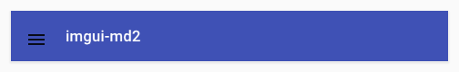

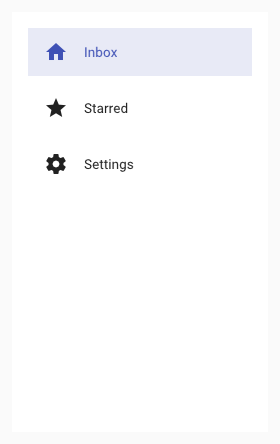

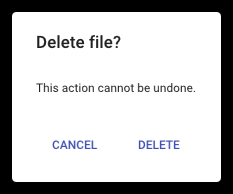

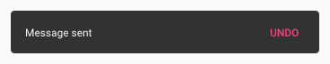

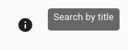

`ElevationShadow` 是逐层近似阴影，elevation 越高扩散越广、越淡：

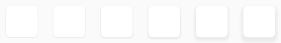

## 8. ID、状态与注意事项

- 动画和 ripple 以 `ImGuiID` 为键；循环中务必使用 `PushID(index/key)`；
- 不要在同一帧让同一个 ID 对应不同种类组件；
- 组件尺寸以像素传入，建议用 `theme.layout.density` 或统一 DPI scale；
- elevation shadow 是多层即时绘制近似，不依赖模糊 shader；
- 字体 atlas 与 GPU texture 的重建仍由 ImGui 后端负责；
- 自定义控件使用 `imgui_internal.h`，公共头文件只依赖 `imgui.h`。
